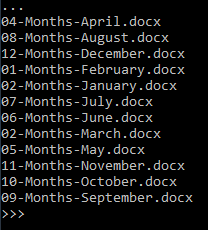

## About
Last Updated *[09/09/2019]*   
Created by [OSU Maps and Spatial Data](https://info.library.okstate.edu/map-room)


## Table of Contents
- Introduction 
- *Renaming Files with Python*
- Conclusion
- Further Reading/Resources

## Introduction

## *Renaming Files with Python*
Simple Python scripts can be used for a variety of tasks. Today, we will be learning how to use Python to rename multiples files within a folder. 
1. To get started, locate the folder that contains the files you wish to rename and open your prefered Python 3 coding terminal.
2. Next, in the terminal, we must use *import os* in order to begin working with our files. 
``` python
  import os
```
3. We will use *chdir* to change the current working directory to a different path. Within the parenthesis, paste or type the path to your folder.
``` python
  os.chdir(r'C:\Users\mapstu\Documents\ExampleRename')
```
4. To make sure we are working in the correct area, we will use a *print* function. It should return the pathway to your file. It is important to use print before we execute anything in order to check our work before it's too late.
```python
  print(os.getcwd())
C:\Users\mapstu\Documents\ExampleRename
```
5. Let's do another check to make sure we're grabbing the right files. For this, we will use a different function. When you execute this, you should see all of your files. 
```python
  for f in os.listdir():
    print(f)
```


6. To make editing file names easier in the long run, we will split the file name from the extension. When this function runs, you should see your file names separate from the file extension.
```python
  for f in os.listdir():
    print(os.path.splitext(f))
```


7. To use this function, we will change it up just slightly. This splits the file names from the extensions. Using the *print* function simply helps us visualize the file names without any extra text.
```python
  for f in os.listdir():
    file_name, file_ext = os.path.splitex(f)
    print(file_name)
```

![File Names}(images/Names.PNG)

8. While we have cleaned up quite a bit, it would be beneficial to isolate the different parts of the file names, such as the name of the month, the category ("Months") and the number associated with each month. To do this, we will split the text further. Luckily for us, we can use *-* as an easy split location.
```python
  for f in os.listdir():
    file_name, file_ext = os.path.splitex(f)
    print(file_name.split('-'))
```


9. Let's execute the above code and double check it. In the last line *print(f_title)*, you will also want to test *print(f_category)* and *print(f_num)*. Running these separately will show just one element at a time.
```python
  for f in os.listdir():
    file_name, file_ext = os.path.splitex(f)
    f_title, f_category, f_num = file_name.split('-')
    print(f_title)
```

10. Let's test how it would look to rearrange the file names where the number comes first, followed by the category, name and then extension. 
```python
  for f in os.listdir():
    file_name, file_ext = os.path.splitex(f)
    f_title, f_category, f_num = file_name.split('-')
    print('{}-{}-{}{}'.format(f_num, f_category, f_title, f_ext))
```


11. If you notice any odd white space in your file names, you can use *strip* to get rid of it. 
```python
  for f in os.listdir():
    file_name, file_ext = os.path.splitex(f)
    f_title, f_category, f_num = file_name.split('-')
    f_title = f_title.strip()
    f_category = f_category.strip()
    f_num = f_num.strip()
    print('{}-{}-{}{}'.format(f_num, f_category, f_title, f_ext))
```
12. One thing that may happen with our numbers is that 1 and 10 will be put next to each other. We can fix this with *zfill*.
```python
  for f in os.listdir():
    file_name, file_ext = os.path.splitex(f)
    f_title, f_category, f_num = file_name.split('-')
    f_title = f_title.strip()
    f_category = f_category.strip()
    f_num = f_num.strip().zfill(2)
    print('{}-{}-{}{}'.format(f_num, f_category, f_title, f_ext))
```



13. Our file names are looking much better, but I think the *category* makes it a bit redundant. Let's get rid of it. 
```python
  for f in os.listdir():
    file_name, file_ext = os.path.splitex(f)
    f_title, f_category, f_num = file_name.split('-')
    f_title = f_title.strip()
    f_category = f_category.strip()
    f_num = f_num.strip().zfill(2)
    print('{}-{}-{}{}'.format(f_num, f_title, f_ext))
```


14. Finally, we can rename our files! 
```python
  for f in os.listdir():
    file_name, file_ext = os.path.splitex(f)
    f_title, f_category, f_num = file_name.split('-')
    f_title = f_title.strip()
    f_category = f_category.strip()
    f_num = f_num.strip().zfill(2)
    new_name = '{}-{}-{}{}'.format(f_num, f_title, f_ext)
    os.rename(f, new_name)
```


## Conclusion

## Further Reading/Resources


[Return to Top](#about)
